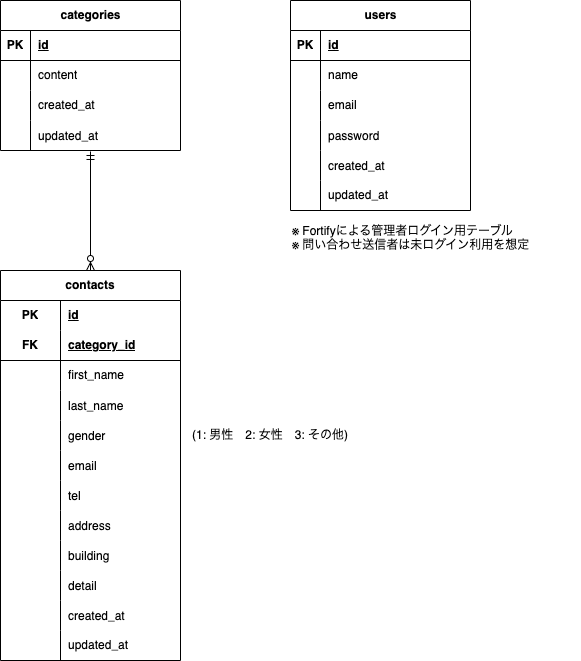

# 環境構築

```bash
1. git clone git@github.com:YuHirasaka/contact-form.git
2. docker compose up -d --build
```

---

## Laravel環境構築

```bash
  1. docker compose exec php bash
  2. composer install
  3. cp .env.example .env (.env.exampleから.envを作成し、環境変数を変更)
  4. php artisan key:generate
  5. php artisan migrate
  6. php artisan db:seed
```

---

## 使用技術

- php 8.1.34
- nginx 1.21.1
- mysql 8.0.26
- laravel 8.83.29

---

## URL

- 開発環境：http://localhost/
- ユーザー登録：http://localhost/register/
- phpMyAdmin：http://localhost:8080/

## ER図


